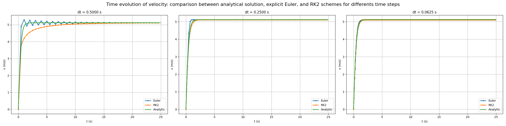
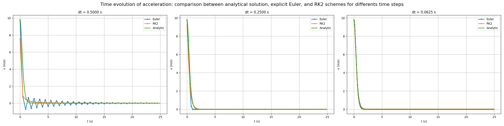
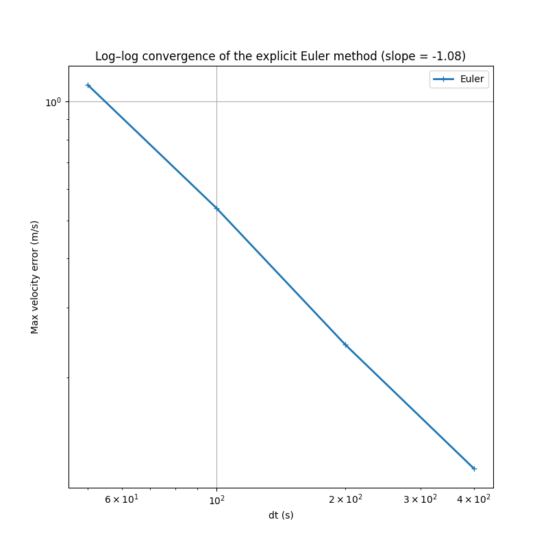
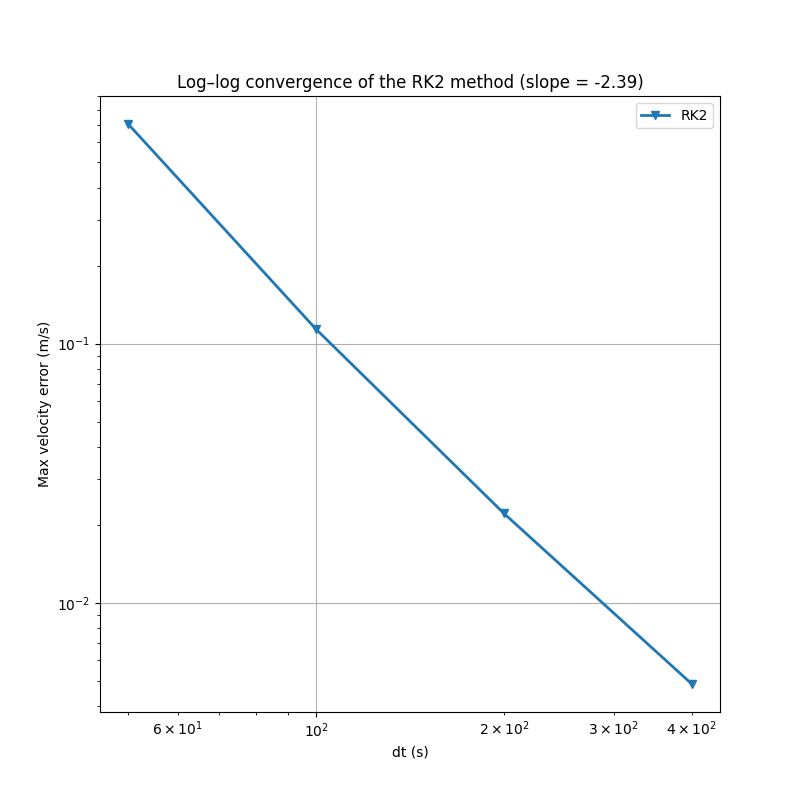

# numerical-analysis-quadratic-drag-c

This project studies the vertical fall of a parachutist subjected to gravity and a quadratic air drag force. An analytical solution of the resulting nonlinear ordinary differential equation is derived. Several numerical methods are then implemented and compared, including the explicit Euler scheme and a second-order Runge–Kutta method, as well as numerical integration and differentiation techniques to recover position and acceleration. The numerical results are validated against the analytical solution, and the influence of model parameters and discretization is analyzed.

---

## 1. Model and Assumptions

The motion is assumed to be strictly one-dimensional and vertical, described in a Galilean reference frame with constant physical parameters.

Two forces act on the parachutist:

- gravity: $`\vec{P}=-mg\vec{e_z}`$,
- quadratic air drag: $` \vec{F_d} = -\alpha v |v| \, \vec{e_z} `$.

Newton’s second law leads to the nonlinear ordinary differential equation

```math
m \frac{dv}{dt} = m g - \alpha v^2.
```

Introducing $\tau=\frac{m}{\alpha}$, this equation can be written as

```math
\boxed{
  \frac{dv}{dt} + \frac{1}{\tau} v^2 = g
}
```

## 2. Analytical Reference Solution

The equation admits an exact solution obtained by separation of variables.
Define

```math
k = \sqrt{\frac{m g}{\alpha}}, \qquad
\tau = \frac{m}{\alpha}, \qquad
C = \frac{v_0 - k}{v_0 + k}
```

### Velocity solution

```math
\boxed{
v(t)=k\,\frac{1 + C\,e^{-2kt/\tau}}{1 - C\,e^{-2kt/\tau}}
}
```

As $t \to \infty$, the velocity converges to the terminal value

```math
\lim_{t\to\infty} v(t) = k = \sqrt{\frac{m g}{\alpha}}
```

### Position solution

Integrating once more, the position $x(t)$ with initial condition $x(0)=x_0$ is

```math
\boxed{
x(t)=x_0 + k\,t
+ \tau \ln\!\left(\frac{1 - C\,e^{-2kt/\tau}}{1 - C}\right)
}
```

## 3. Numerical Schemes

Defining
```math
f(t,v)= g-\frac{1}{\tau}v^2,
```

### Time integration (velocity)

The velocity equation is discretized in time using:

- **Explicit Euler**

```math
\left\{
\begin{aligned}
v^0 &= v_0 \\
v^{n+1} &= v^n + \Delta t\, f(t_n, v^n)
\end{aligned}
\right.
```

- **Runge–Kutta 2 Heun**

```math
\left\{
\begin{aligned}
v^0 &= v_0 \\
k_1 &= f(t_n, v^n) \\
k_2 &= f\!\left(t_n+\frac{\Delta t}{2},\, v^n + \frac{\Delta t}{2}\,k_1\right) \\
v^{n+1} &= v^n + \Delta t\,k_2
\end{aligned}
\right.
```


### Integration (position)

Given discrete velocities $v^n \approx v(t_n)$ with time step $\Delta t$, the position is reconstructed by:

**Trapezoidal rule**

```math
\left\{
\begin{aligned}
x^0 &= x_0 \\
x^{n+1} &= x^n + \frac{\Delta t}{2}\left(v^n + v^{n+1}\right)
\end{aligned}
\right.
```

### Differentiation (acceleration)

Given discrete velocities $v^n$, acceleration is approximated by a forward finite difference:

```math
\left\{
\begin{aligned}
a^n &= \frac{v^{n+1}-v^n}{\Delta t}, \qquad n=0,\dots,N-1
\end{aligned}
\right.
```


## 4. Results 


### Velocity integration 

### Position integration

### Acceleration derivation


### 4.2 Order of convergence 



